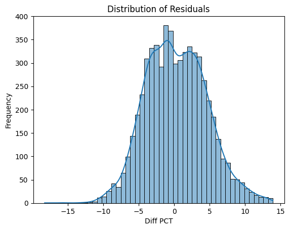
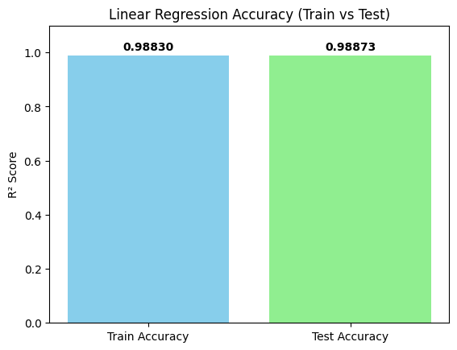
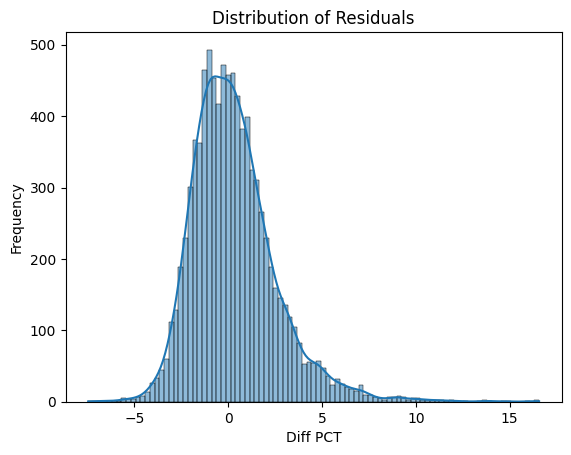
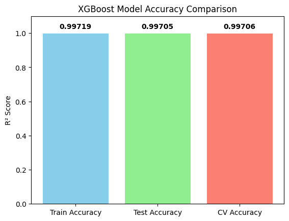

# 🧠 Health Insurance Premium Cost Predictor (99% Accuracy)

Welcome to the ultimate health insurance cost prediction app! 🚀  
With our **dual-model** strategy and smart feature engineering, we've built a system that predicts premiums with **R² up to 99%** and **less than 4% error**.

---

## 📂 Project Overview

This project started as a simple regression task—but after diving deep into **error analysis**, we uncovered that **age plays a huge role** in prediction accuracy.

💡 Solution? We split our models:

- 👶 **Young Model (Age ≤ 25)** → Linear Regression  
- 🧓 **Rest Model (Age > 25)** → XGBoost Regressor

With the addition of the **Genetical Risk** feature, both models saw dramatic improvements.

---

## 🔍 Quick Look

```
📁 health-insurance-premium-cost-prediction-xgboost-99-accuracy
├── app/
│   └── app.py               ← Streamlit web app
├── artifacts/               ← Visualizations (accuracy, residuals)
├── notebooks/               ← Model development Jupyter notebooks
├── prediction_helper.py     ← Model prediction utility
├── requirements.txt         ← Python dependencies
└── README.md                ← You are here!
```

---

## 🌐 Live Demo
Check it out here: [Streamlit App](https://mehul-health-insurance-cost-prediction-xgboost-99-accuracy.streamlit.app/)

## 🚀 Try It Out

```bash
git clone https://github.com/mehulcode12/health-insurance-premium-cost-prediction-xgboost-99-accuracy.git
cd health-insurance-premium-cost-prediction-xgboost-99-accuracy
pip install -r requirements.txt

# Run the Streamlit app
cd app
streamlit run app.py
```

---

## 🧠 Modeling Strategy

### 1️⃣ Initial Baseline
- Used a single Linear Regression model.
- **Problem:** 98% R², but error rate > 60% for **young** users.

### 2️⃣ Root Cause Analysis
- Split the dataset by age (≤ 25 vs > 25).
- Found young users skewed the prediction error.

### 3️⃣ Dual Model Solution
- Trained **separate models** for each group:
  - **Young:** Linear Regression
  - **Rest:** XGBoost (with RandomizedSearchCV tuning)
- Added **Genetical Risk** feature = game changer 💥

---

## 📊 Model Evaluation

### 👶 Age ≤ 25 (Linear Regression + Genetical Risk)
- **R² (Train/Test):** ~0.99 / 0.99
- 📉 Residuals:  
  
- ✅ Accuracy:  
  

### 🧓 Age > 25 (XGBoost + Genetical Risk)
- **R² (Train/Test/CV):** ~0.997 / 0.997 / 0.997
- 📉 Residuals:  
  
- ✅ Accuracy:  
  

---

## 🛠 Tech Stack

- **ML Models**: Linear Regression, XGBoost
- **Tuning**: GridSearchCV, RandomizedSearchCV
- **Visualization**: Matplotlib, Seaborn
- **Web App**: Streamlit
- **Backend**: Python, pandas, NumPy

---

## 📘 Related Files

| Notebook | Description |
|----------|-------------|
| `ml_premium_prediction_young_with_gr.ipynb` | Model for users ≤ 25 yrs |
| `ml_premium_prediction_rest_with_gr.ipynb`  | Model for users > 25 yrs |
| `SourceOfWork.pdf`                          | Detailed analysis + methodology |

---

## 🤝 Contribute

Have ideas to improve it? Open a PR or raise an issue! Contributions are welcome 🙌

---

## 📄 License

MIT License © 2025 Mehul

---

⭐ If you liked this project, leave a star on [GitHub](https://github.com/mehulcode12/health-insurance-premium-cost-prediction-xgboost-99-accuracy)!
